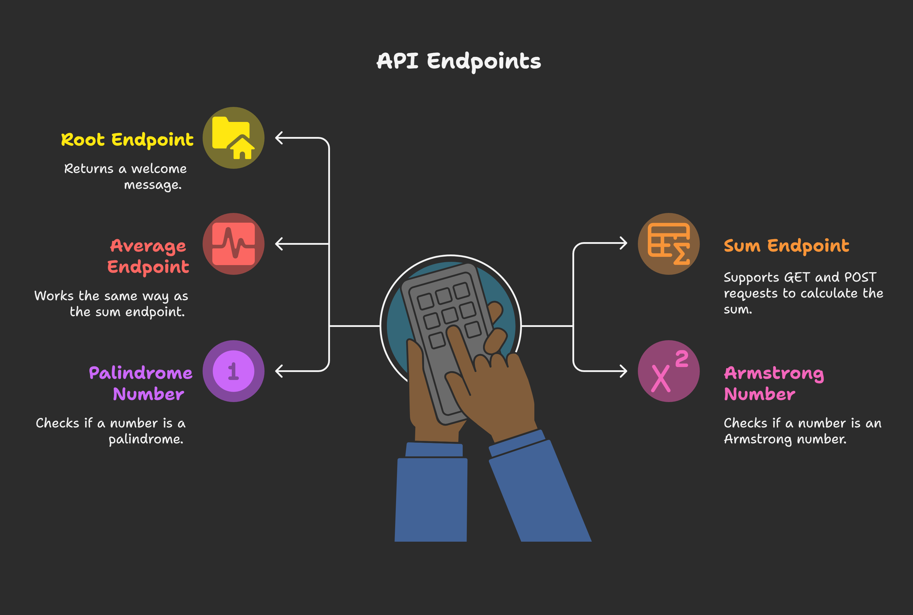
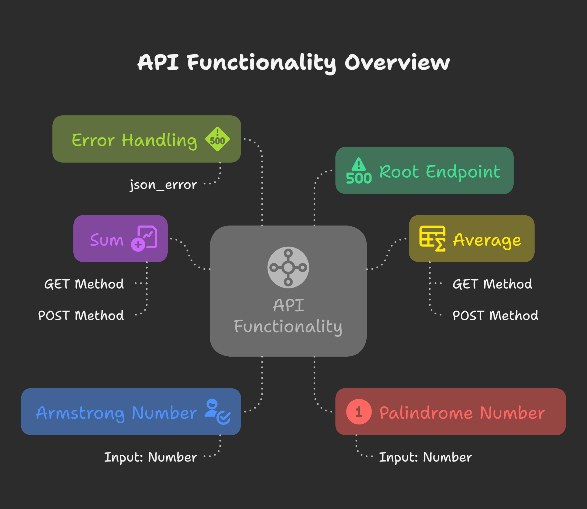

# restAPI (Python + Flask)



A small example REST API using Python and Flask. This repository contains a minimal Flask app in `src/main.py` with a root endpoint and an Armstrong-number checker endpoint.

## Features
- GET `/` — returns a simple greeting ("Hello, World!").
- GET `/armstrong/<int:n>` — returns whether `n` is an Armstrong number as JSON.

## Requirements
- Python 3.8+ recommended. If you use Python 3.13, be aware some older package wheels may not support it; prefer 3.11 for maximum compatibility.
- Flask (install into the virtual environment used to run the app).

## Quick start (Windows, cmd.exe)

1. Open a cmd prompt and change to the project folder.

2. (Optional) Create and activate a virtual environment if you don't already have one:

```batch
python -m venv .venv
.venv\Scripts\activate.bat
# restAPI (Python + Flask)

A small example REST API using Python and Flask. The app lives at `src/main.py` and provides a few simple numeric utilities and endpoints suitable for learning and small demos.

## Features



- GET `/` — returns a simple greeting ("Hello, World!").
- GET `/armstrong/<int:n>` — returns whether `n` is an Armstrong number.
- GET `/palindrome/<int:n>` — returns whether `n` is a palindrome (supports ordinary integers, including 4-digit numbers like `1221`).
- GET `/sum?a=2&b=3` — returns the sum of `a` and `b` (query params).
- POST `/sum` — accepts JSON `{ "a": <int>, "b": <int> }` and returns the sum.
- GET `/avg?a=2&b=3` — returns the average of `a` and `b` (query params). (If you want the `/avg` endpoints implemented, enable them in the repo — ask me and I'll add them.)

## Requirements
- Python 3.8+ recommended. If you use Python 3.13, some wheels may not be available; prefer 3.11 if you run into install problems.
- See `requirements.txt` for the minimal dependencies to run and test the project.

## Quick start (Windows, cmd.exe)

1. Open a cmd prompt and change to the project folder:

```batch
cd /d "Z:\Projects\restAPI using python & flask"
```

2. (Optional) Create and activate a virtual environment:

```batch
python -m venv .venv
.venv\Scripts\activate.bat
```

3. Install dependencies:

```batch
python -m pip install --upgrade pip
python -m pip install -r requirements.txt
```

4. Run the app:

```batch
python src\main.py
```

By default the app runs on `http://127.0.0.1:5000`.

## API endpoints & examples

Root

```batch
curl http://127.0.0.1:5000/
# {"message":"Hello, World!"}
```

Armstrong

```batch
curl http://127.0.0.1:5000/armstrong/153
# {"Number":153,"Armstrong":true,"Server IP":"127.0.0.1:5000"}
```

Palindrome

```batch
curl http://127.0.0.1:5000/palindrome/1221
# {"Number":1221,"Palindrome":true,"Server IP":"127.0.0.1:5000"}
```

Sum (GET, query params)

```batch
curl "http://127.0.0.1:5000/sum?a=2&b=3"
# {"a":2,"b":3,"result":5}
```

Sum (POST, JSON body)

```batch
curl -H "Content-Type: application/json" -d "{\"a\":2,\"b\":3}" http://127.0.0.1:5000/sum
# {"a":2,"b":3,"result":5}
```

Average (direct function)

```python
from src.main import avg
print(avg(2, 3))  # 2.5
```

If you want `/avg` HTTP endpoints added (GET/POST), tell me and I'll implement them and tests.

## Testing

Tests are in the `tests/` folder and use `pytest`.

Install test requirements and run tests:

```batch
python -m pip install -r requirements.txt
python -m pytest -q
```

## Troubleshooting

- ImportError / ModuleNotFoundError on `from flask import ...`:
	- Ensure you activated the virtualenv and installed the requirements used by the interpreter that will run the app.
	- Check Flask installation:

		```batch
		python -m pip show flask
		python -c "import flask,sys; print(flask.__file__, flask.__version__, sys.executable)"
		```

- Watch for accidental local files named `flask.py` (or folders) that can shadow the real package.

## Development notes
- Main app file: `src/main.py`.
- Tests: `tests/test_core.py` (logic) and `tests/test_api.py` (API endpoints).
- License: see `LICENSE` (MIT).
